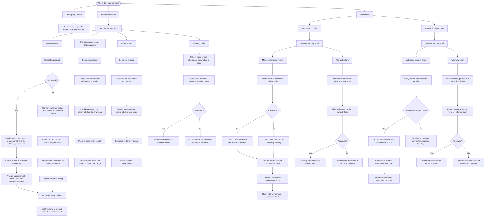

---
config:
  layout: elk
---

```mermaid
flowchart TB

    A(["Where did you purchase?"]) --> B["Silkandsnow.com"] & C["Retail store"] & D["Third-party vendor"]
    D --> D1["Follow vendor specific return / warranty process"]
    B --> B0["How can we help you?"]
    B0 --> B1["Warranty claim"] & B2["Mattress return"] & B3["Furniture / Accessory / Bedding return"] & B4["Other returns"]
    B2 --> M1["Select the product"]
    M1 --> M2{"Is it boxed?"}
    M2 -- Yes --> M3["Confirm customer details: name, email, phone, address, pickup date"]
    M3 --> M4["Collect photos of mattress and law tag"]
    M4 --> M5["Provide customer with return label and confirmation email"]
    M5 --> M6["Vendor picks up product"]
    M6 --> M7["Notify internal team and submit order for refund"]
    M2 -- No --> M8["Confirm customer details and reason for unboxed return"]
    M8 --> M9["Collect photos of product and law tag for review"]
    M9 --> M10["Send details to vendor for condition review"]
    M10 --> M11["Vendor approves pickup"]
    M11 --> M6
    B3 --> F1["Select the product"]
    F1 --> F2["Collect customer details and photos of product"]
    F2 --> F3["Provide customer with return label and instructions"]
    F3 --> F4["Product received by vendor"]
    F4 --> F5["Notify internal team and process refund / exchange"]
    B4 --> O1["Select the product"]
    O1 --> O2["Collect details and photos as needed"]
    O2 --> O3["Provide customer with return label or next steps"]
    O3 --> O4["Item received and reviewed"]
    O4 --> O5["Process refund / replacement"]
    B1 --> W1["Collect order details, photos and description of issue"]
    W1 --> W2["Send case to vendor / warranty team for review"]
    W2 --> W3{"Approved?"}
    W3 -- Yes --> W4["Arrange replacement / repair or refund"]
    W3 -- No --> W5["Communicate decision and options to customer"]
    C --> C1["Shopify store order"] & C2["In-store POS purchase"]
    C1 --> CS0["How can we help you?"]
    CS0 --> CS1["Mattress / product return"] & CS2["Warranty claim"]
    CS1 --> CS3["Select product and verify original order"]
    CS3 --> CS4{"Is it boxed?"}
    CS4 -- Yes --> CS5["Collect customer details and photos if needed"]
    CS4 -- No --> CS6["Collect details and photos including law tag"]
    CS5 --> CS7["Provide return label or store instructions"]
    CS6 --> CS7
    CS7 --> CS8["Vendor / warehouse receives product"]
    CS8 --> CS9["Notify internal team and process refund"]
    CS2 --> CS10["Collect order details and photos for warranty"]
    CS10 --> CS11["Submit claim to vendor / warranty team"]
    CS11 --> CS12{"Approved?"}
    CS12 -- Yes --> CS13["Arrange replacement / repair or refund"]
    CS12 -- No --> CS14["Communicate decision and options to customer"]
    C2 --> S0["How can we help you?"]
    S0 --> S1["Mattress / product return"] & S2["Warranty claim"]
    S1 --> S3["Verify receipt and purchase details"]
    S3 --> S4{"Within store return rules?"}
    S4 -- Yes --> S5["Accept item in store and create return in POS"]
    S5 --> S6["Ship item to vendor / warehouse if required"]
    S6 --> S7["Refund or exchange completed in store"]
    S4 -- No --> S8["Escalate to customer service for exception handling"]
    S2 --> S9["Collect receipt, photos and issue description"]
    S9 --> S10["Submit warranty case to vendor / internal team"]
    S10 --> S11{"Approved?"}
    S11 -- Yes --> S12["Provide replacement / repair or refund"]
    S11 -- No --> S13["Communicate decision and options to customer"]
```
