# High Level Process Flow

## Narrative Steps

## Narrative Steps

1. **Purchase Channel Selection** – Customer selects:
    *   Silk & Snow Online – CA / US (Shopify)
    *   Silk & Snow Retail Store (in-person)
    *   Third-Party Vendor
    
    For Retail Store selections, the portal uses a **store lookup** to determine whether the store backend is **Shopify POS** or **STORIS (non-Shopify)**.

    **Retail Store Backend Handling**
    *   If the selected store is a **Shopify POS store**, the portal routes the customer into the **same Shopify order flow** used for online orders (orders in Shopify Online + Shopify POS).
    *   If the selected store is a **STORIS (non-Shopify) store**, the portal displays a message that **returns for this store must be handled in person** and the flow ends (no online processing, no label generation, no ticket).

2. **Customer Intent Selection** – The customer chooses to start a return, warranty claim or another return type (if configured). The flow branches accordingly.

3. **Order Lookup** – For online orders the customer must enter their email and order number. Both fields must match exactly with the WooCommerce record; otherwise no order details are displayed.

4. **Display Order Items & Eligibility** – All items on the order are shown with variant image, colour, category and eligibility status. Eligibility is computed using product category, return window, trial length, final sale rules, channel and delivered date.

5. **Item Selection** – The customer selects one or more eligible items. A minimum of one item is required.
    *   **Bundle / Free Item Promotion:** If the item is part of a bundle or free item promotion, the customer can keep bundled/free items at **50% of full website price**; the refund is adjusted accordingly.

6. **Reason Selection** – The customer chooses a reason for each selected item. Return reasons map to WooCommerce refund reasons.

7. **Documentation Upload** – For claims and damage returns, customers must provide required documentation (photos, measurements, etc.).

8. **Logistics & Labels** – The flow splits based on product type:
    *   **Mattress (Boxed):** Collect photos/law tag. Provide return label/pickup instructions. Vendor picks up and updates status to 'Picked'.
    *   **Mattress (Unboxed):** Collect condition and donation eligibility. **No photos sent to vendor.** Return Logistics Manager selects donation/pickup vendor. Vendor change triggers update emails. Vendor picks up and updates status to 'Picked'.
    *   **Furniture:** Two-step process:
        1.  **Pre-approval:** Customer uploads photos/issue details. **CX reviews and approves/declines.**
        2.  **Logistics:** On approval, collect **access constraints** and pickup dates. Generate label/instructions.
    *   **Accessory/Bedding:** Single step. Collect reason/photos -> Generate label & mail-in instructions.

9. **Ticket Creation** – The Claimlane ticket stores all details. Duplicate tickets are prevented.

10. **Backend Actions** – Upon submission:
    *   **Automatic Refund for Low-Value Returns:** When "Received" and net refund value < **600**, auto-initiate refund (if gateway supported).
    *   **Manual Refund for High-Value Returns:** When "Received" and net refund value >= **600**, route to CX for manual processing.
    *   **Caledonia Workflow:** For Caledonia returns, the team updates status **Delivered -> Processing / Inspection Completed**. Store Ops runs report for inventory.

---

## Visual Process Flow

```mermaid
flowchart TB

    %% ---------------------------------------------------------------------
    %% CALEDONIA – BACK-OFFICE RETURNS HANDLING
    %% ---------------------------------------------------------------------
    subgraph CALEDONIA["Canada returns routed to Caledonia"]
        R1["Return delivered to Caledonia"]
        R2["Caledonia team updates return status in portal (limited access role)"]
        R4["Update status: Delivered → Processing / Inspection Completed"]
        R5["Store Ops run 'Returned items' report for inventory update"]
    end

    %% ---------------------------------------------------------------------
    %% ENTRY POINT – PURCHASE CHANNEL SELECTION
    %% ---------------------------------------------------------------------
    A["Where did you purchase?"] 
      --> Online["Silk & Snow Online – CA / US (Shopify)"] & Retail["Silk & Snow Retail Store (in-person)"] & D["Third-party vendor"]

    %% Third-party vendors
    D --> D1["Follow vendor-specific return / warranty process"]

    %% Retail store selector – system decides Shopify POS vs STORIS
    Retail --> RS1["Select the store you purchased from"]
    RS1 --> RS2{"Store backend (system lookup)"}
    RS2 -- "Shopify POS store" --> B["Orders in Shopify (Online + Shopify POS)"]
    RS2 -- "STORIS (non-Shopify) store" --> RS3["Show message: this store handles returns in person only (no online processing)"]
    RS3 --> RSEnd["End – customer must visit store to complete return"]

    %% Online orders – also go into Shopify-based flow
    Online --> B

    %% ---------------------------------------------------------------------
    %% MAIN SHOPIFY FLOW – DTC + SHOPIFY POS
    %% ---------------------------------------------------------------------
    B --> B0["What do you need help with?"]
    B0 --> BR["Return"] & BW["Warranty claim"]

    %% DTC / POS Return – order validation and item selection
    BR --> OR1["Enter order number and email"]
    OR1 --> OR2{"Order validated?"}
    OR2 -- No --> OR2N["Show error and allow retry or contact support"]
    OR2 -- Yes --> OR3["Display all items in order"]
    OR3 --> OR4["Customer selects one or more items to return"]

    %% Bundle / free item rule – applies to mattress & accessory bundles
    OR4 --> BND1{"Part of bundle / free item promotion?"}
    BND1 -- Yes --> BND2["Prompt: customer can keep bundled / free items at 50% of full website price; adjust refund"]
    BND2 --> OR5{"Item type selected"}
    BND1 -- No --> OR5{"Item type selected"}

    %% Mattress path (bundle logic handled above)
    OR5 -- Mattress --> M2{"Is mattress boxed?"}

    %% Furniture path – two-step (photos then logistics)
    OR5 -- Furniture --> F1["Furniture return"]

    %% Accessory / Bedding path – mail-in (bundle logic handled above)
    OR5 -- Accessory/Bedding --> A1["Accessory / Bedding return"]

    %% Warranty claim entry
    BW --> OW1["Enter order number and email"]
    OW1 --> OW2{"Order validated?"}
    OW2 -- No --> OR2N
    OW2 -- Yes --> OW3["Display all items in order"]
    OW3 --> OW4["Customer selects one or more items for warranty"]
    OW4 --> WEntry["Proceed to warranty questionnaire and review"]

    %% ---------------------------------------------------------------------
    %% MATTRESS LOGISTICS – BOXED vs UNBOXED
    %% ---------------------------------------------------------------------
    M2 -- Yes --> MInfo["Collect extra info: photos, law tag, preferred pickup dates"]
    MInfo --> MInstr["Provide return label / pickup details and instructions"]
    MInstr --> M3@{ label: "Vendor picks up mattress and updates status to 'Picked'" }

    M2 -- No --> MUInfo["Collect extra info: condition, donation eligibility (no photos sent to vendor)"]
    MUInfo --> U1["Return Logistics selects donation / pickup vendor"]
    U1 --> U6["Trigger emails: vendor + customer"]
    U6 --> U8{"Change vendor?"}
    U8 -- Yes --> U9["Select new vendor → trigger updated emails"]
    U9 --> M3
    U8 -- No --> M3

    M3 --> Received@{ label: "Item marked 'Received' in portal" }

    %% ---------------------------------------------------------------------
    %% FURNITURE RETURNS – CX REVIEW THEN LOGISTICS
    %% ---------------------------------------------------------------------
    F1 --> FInfoPhotos["Step 1: Customer uploads photos + issue details"]
    FInfoPhotos --> FCXReview["CX reviews photos / info"]
    FCXReview --> FCXApprove{"CX approves return?"}
    FCXApprove -- No --> FCXDecline["Communicate decline or alternative options"]
    FCXApprove -- Yes --> FInfoDetails["Step 2: Collect access constraints, pickup dates, contact info"]
    FInfoDetails --> FLabelPickup["Generate carrier label + pickup instructions"]
    FLabelPickup --> F3["Arrange pickup"]
    F3 --> Received

    %% ---------------------------------------------------------------------
    %% ACCESSORY / BEDDING RETURNS – MAIL-IN
    %% ---------------------------------------------------------------------
    A1 --> AInfo["Collect extra info: reason, photos if needed"]
    AInfo --> AInstr["Provide label + return-by-mail instructions"]
    AInstr --> A2["Customer ships item"]
    A2 --> Received

    %% ---------------------------------------------------------------------
    %% WARRANTY FLOW
    %% ---------------------------------------------------------------------
    WEntry --> WInfo["Collect issue description, photos, documentation"]
    WInfo --> W2["Submit warranty case to vendor / CX"]
    W2 --> W3{"Approved?"}
    W3 -- Yes --> W4["Arrange replacement / refund / repair"]
    W4 --> FinalProcess["Close case / completion"]
    W3 -- No --> W5["Communicate decision + options"]

    %% ---------------------------------------------------------------------
    %% CALEDONIA PROCESS & REFUND LOGIC
    %% ---------------------------------------------------------------------
    R1 --> R2
    R2 --> R4
    R4 --> R5

    Received --> RV1{"Return order value < 600?"} & R1
    RV1 -- Yes --> AutoRefund["Portal automatically initiates refund"]
    RV1 -- No --> ManualRefund["CX manually processes refund"]
    AutoRefund --> FinalProcess
    ManualRefund --> FinalProcess
    R5 --> FinalProcess

    %% Shape hints for key system states
    M3@{ shape: rect}
    Received@{ shape: rect}
```

---

## Discussion

> 💬 **Comments for this page are available in Giscus.**  
> Once Giscus is configured, the discussion thread for this page will appear here.

