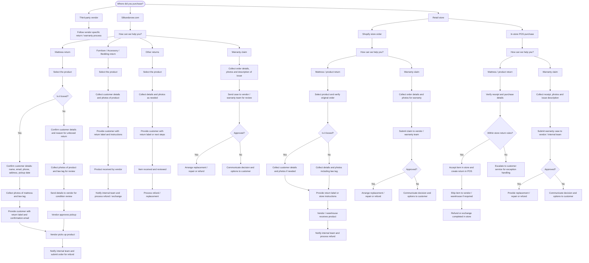

# High Level Process Flow

## Narrative Steps

1. **Purchase Channel Selection** – The customer selects the purchase source (silkandsnow.com/.ca, retail store, Shopify order, POS purchase, third-party vendor). Third-party vendor orders do not proceed through Claimlane; vendor instructions are shown instead.

2. **Customer Intent Selection** – The customer chooses to start a return, warranty claim or another return type (if configured). The flow branches accordingly.

3. **Order Lookup** – For online orders the customer must enter their email and order number. Both fields must match exactly with the WooCommerce record; otherwise no order details are displayed.

4. **Display Order Items & Eligibility** – All items on the order are shown with variant image, colour, category and eligibility status (e.g., Eligible, Trial Ended, Final Sale, Already Returned). Eligibility is computed using product category, return window, trial length, final sale rules, channel and delivered date.

5. **Item Selection** – The customer selects one or more eligible items (partial quantities allowed). Category filtering hides items not applicable to the selected return type. A minimum of one item is required; a soft warning is triggered if more than two units of the same product type are selected.

6. **Reason Selection** – The customer chooses a reason for each selected item from pre-configured lists. Return reasons map to WooCommerce refund reasons; warranty claim reasons are category-specific and do not allow "Other/Change of Mind". Selecting a damage or defective reason triggers documentation upload requirements.

7. **Documentation Upload** – For claims and damage returns, customers must provide required documentation (e.g., photos of base, measurements, visible tags, invoice copy, lot number). The required documentation depends on the claim reason and product category.

8. **Logistics & Labels** – If the product is eligible for a label, the customer enters the number of boxes (1–20) and a label is generated per box. For boxed mattresses, pickup instructions and photo requirements are shown. For unboxed mattresses or oversized furniture, vendor approval and freight rules apply. Tracking numbers are stored in the ticket.

9. **Ticket Creation** – The Claimlane ticket stores order details, customer details, selected items and quantities, documentation, labels, return or claim reason, eligibility status and tags (product category, issue type). Duplicate tickets for the same items within a short window are prevented.

10. **Backend Actions** – Upon submission the system triggers automatic refunds via WooCommerce (where supported) and/or creates replacement orders for approved warranty claims. Exception flows handle POS returns, vendor review requirements, manual refunds and customer service overrides.

---

## Visual Process Flow

---

## Discussion

> 💬 **Comments for this page are available in Giscus.**  
> Once Giscus is configured, the discussion thread for this page will appear here.

